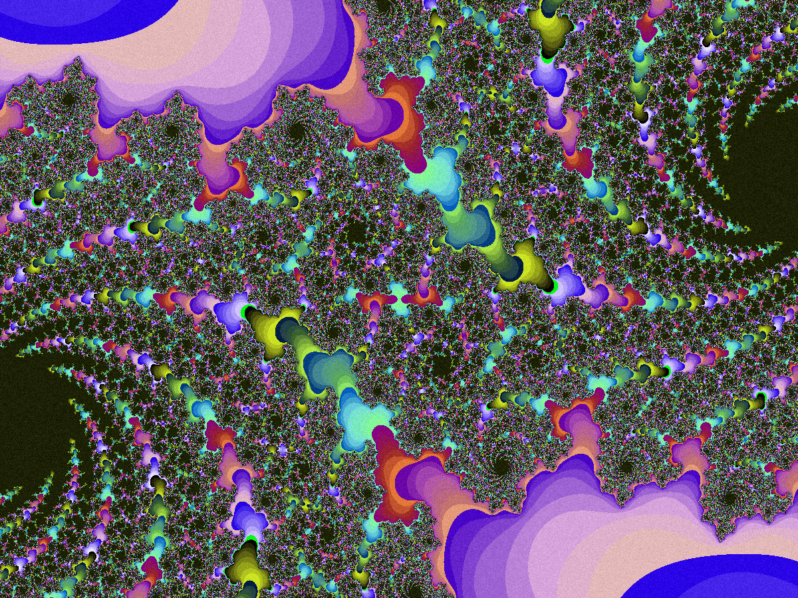

# APOTHEOSIS: A Simple Program for Creating Fractals

### CONTEXT

TO DO. To put simply, I would like to develop an easy-to-use program for creating fractals -- an intuitive experience through which to learn about fractal geometry and emergent complexity.

### IMPLEMENTATION

Currently building basic functionality.

TO DO: add various sets; GIF output; image post-process tools; browser implementation.

### INSTALLATION

Clone repository:

```
git clone https://github.com/pixel-tree/apotheosis.git
```

Create virtualenv:

e.g.

```
cd apotheosis
virtualenv -p python3.6 .
source ./bin/activate
```

Install dependencies:

```
pip install -r requirements.txt
```

### USE

Run program:

```
python fractal.py --pattern i --dimensions X Y --scale j --save True/False
```

Arguments (optional):

--pattern, -p

*String. Julia is currently the only available set.*

--dimensions, -d

*Two arguments. Integers. E.g. 1200 900.*

--scale, -s

*Integer. Try 1-10.*

--save, -w

*Boolean. True/False.*
