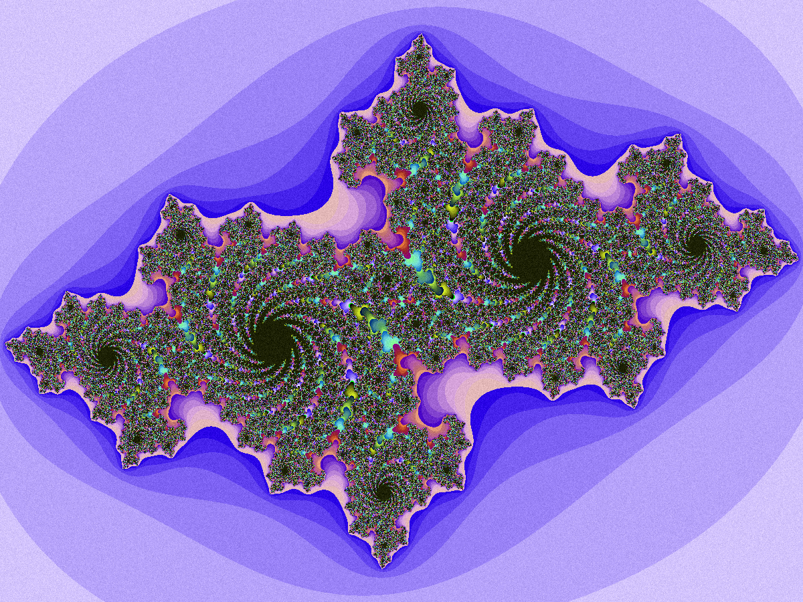

# APOTHEOSIS: An Introduction to Algorithms and Complexity Through Fractal Geometry

A simple program for creating fractals. URL: *tbc*.

### Context

TO DO. Axioms. Knowledge representation. Modelling nature. Playing God. Emergence. Yada yada.

### Program

Currently implementing basic functionality in Python (3.6). Once I have everything running, I will start devising an application for the browser. To put it simply, the idea is to create an intuitive experience for its user to learn about algorithmic systems, bias and emergent complexity.
